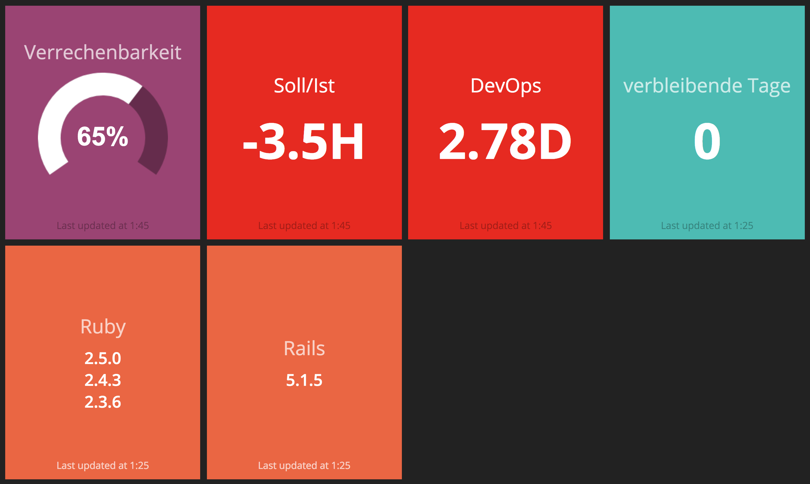

# Work Dashboard



This is my personal dashboard used at work. It includes:

- Ratio of billable versus non-billable work time of the current month
- Amount of overtime/minus hours of the current year
- Hours in the current month worked on specific projects (DevOps and Smoothies)
- Work days left in the current month (gives some context to the other data)
- Stable versions of Ruby
- Latest stable Rails version
- Amount of sugar cubes consumed today (tracked on https://sugarcubes.ch)

## Setup

Set the following environment variables:

```
MOCO_NAME         # The name as it appears in Moco, e.g. Max Mustermann
MOCO_USER         # The email address used to log on Moco
MOCO_PASSWORD     # The password used to log on Moco
SUGAR_CUBES_TOKEN # The token used for sugarcubes.ch
RACK_SECRET       # Random secret for Rack
GOOGLE_DOMAIN     # Domain limited to Google authentication
GOOGLE_CLIENT_ID  # Client ID for Google authentication
GOOGLE_SECRET     # Secret for Google authentication
```

Start the dashboard:

```
smashing start
```
