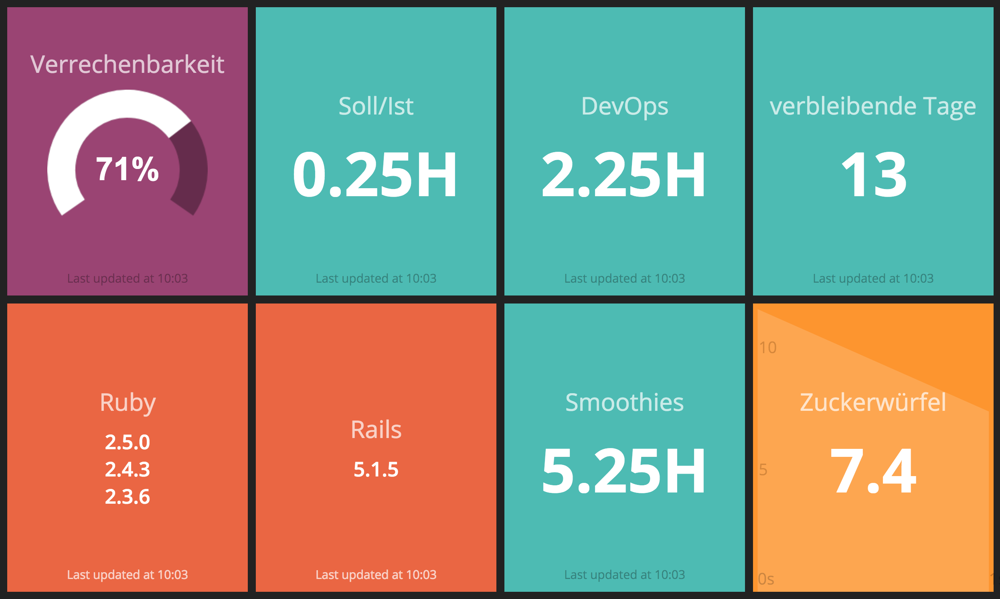

# Work Dashboard



This is my personal dashboard used at work. It includes:

- Ratio of billable versus non-billable work time of the current month
- Stable versions of Ruby
- Latest stable Rails version

## Setup

Set the following environment variables:

```
RACK_SECRET       # Random secret for Rack
HLEDGER_CLIENTS   # The file path to clients.yml
HLEDGER_TIMECLOCK # The file path to the hledger timeclock
NETATMO_CLIENT_ID
NETATMO_CLIENT_SECRET
NETATMO_CLIENT_USERNAME
NETATMO_CLIENT_PASSWORD
```

Start the dashboard:

```
bundle
bundle exec smashing start
```
